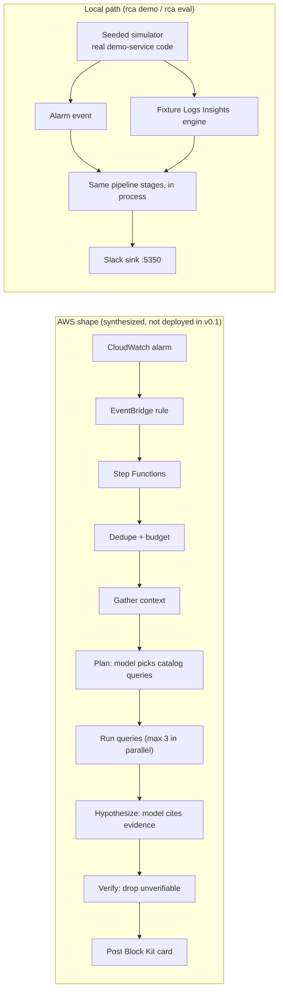

# rca-bot

**Top-1 root cause on labelled chaos scenarios: 100.0% (1/1) with qwen3.8:27b (partial: 1 of 15 planned runs finished), with 0 unverified claims posted; the verifier blocked 30 of 30 injected fabricated citations.** Simulated incidents only (`local-fixture`); see [bench/README.md](bench/README.md).

An alarm fires. The bot picks a few read-only CloudWatch Logs Insights queries from a fixed catalog, asks a model for root-cause hypotheses, and posts a Slack card. A deterministic verifier checks every citation first: if a quoted value is not verbatim in the stored query results, the whole hypothesis is dropped and never posted.

## 30-second demo

No AWS account is needed. A seeded simulator runs the real demo-service code under a labelled chaos fault, raises the alarm, and the bot investigates it.

```bash
npm ci
docker compose up -d --wait slack-sink      # local Slack stand-in on http://localhost:5350
npx tsx src/cli/main.ts demo ddb-throttle-40
# open http://localhost:5350 to see the card
docker compose down
```

Without Docker the card is written to `.rca/slack/` instead. Output from a real run (`docs/demo-output.txt`):

```text
Simulated ddb-throttle-40 (seed 1001): 3600 requests, 22036 log events; fault ddb_throttle from 2026-10-03T09:50:00.000Z
Alarm orders-5xx-rate fired at 2026-10-03T09:53:00.000Z

Incident inc-202610030953-c549e9 - orders - POSTED
Alarms: orders-5xx-rate
Model: heuristic (2 calls, 0 in / 0 out tokens), 6 queries run

Top hypothesis: DEPENDENCY_THROTTLING (confidence Medium)
  DynamoDB throttling: 247 ProvisionedThroughputExceededException errors in the window.
Evidence:
  q6 throttling_exceptions row 0: errorType=ProvisionedThroughputExceededException
  q1 errors_by_message row 0: errorType=ProvisionedThroughputExceededException, message=order write failed
Deploy: 2026-10-03T09:35:00.000Z rca-demo-payments 41 -> 42

Card posted to http://localhost:5350/
Investigation took 1141 ms
```

Try the other scenarios with `npx tsx src/cli/main.ts chaos list`, and a real local model with `--model ollama:qwen3.8:27b` (needs [Ollama](https://ollama.com) running).

## Architecture



The Lambda handlers and the local pipeline call the same stage functions in `src/pipeline/investigate.ts`.

## How it stays honest

| # | Guarantee | Where it lives |
|---|---|---|
| I1 | Every posted hypothesis has evidence, and each quoted value equals a stored result row verbatim. One bad reference drops the whole hypothesis. | `src/core/verifyEvidence.ts` |
| I2 | Only catalog queries run. Model text never becomes query syntax. | `src/core/catalog.ts` |
| I3 | At most 6 queries per incident, each window at most 60 minutes and inside the incident window. | `src/steps/dedupeBudget.ts`, `src/core/catalog.ts` |
| I4 | At the daily token cap the card says "budget exhausted" and no model is called. | `src/steps/dedupeBudget.ts` |
| I5 | One incident per service per grouping window. Duplicate alarms make no model calls. | `src/ports/incidentStore.ts` |
| I6 | Investigator IAM roles have an explicit action allowlist and no `*` actions. | `infra/lib/investigator-stack.ts` |
| I7 | Chaos flags expire. A rule reverts expired flags every minute. | `src/chaos/flag.ts`, `infra/lib/chaos-stack.ts` |
| I8 | Chaos can only change a parameter tagged `chaos:allowed=true`. | `src/chaos/chaos.ts`, IAM condition |
| I9 | The confidence band is computed from the evidence, never taken from the model. | `src/core/confidence.ts` |
| I10 | A malformed model answer is retried once, then the incident ends inconclusive. | `src/steps/hypothesize.ts` |
| I11 | Slack interaction signature checks. | **v0.2** (buttons are rendered but not wired) |
| I12 | Prompts are redacted (emails, card numbers) and truncated. | `src/core/redact.ts` |

Each row has tests. `npm test` runs offline (no network, Docker, AWS or Ollama).

## Results

All numbers are from `bench/results/` (environment `local-fixture`; see [bench/README.md](bench/README.md) for method and caveats).

| Bench | Model | n | Result |
|---|---|---|---|
| Top-1 root cause, 5 labelled scenarios | heuristic baseline | 15 | 100% (top-2 100%), unverified posted 0 |
| Top-1 root cause, 1 labelled scenarios | ollama qwen3.8:27b | 1 of 15 planned | 100.0% (1/1), top-2 100.0% (1/1), unverified posted 0, median 894167 ms |
| Fabricated citations blocked | verifier (heuristic + fabricator) | 30 | 30 of 30 (honest hypotheses kept: 15 of 15) |

The heuristic baseline was written next to the simulator, so its score shows the scenarios are separable, not that the bot is smart.

## Install

```bash
npm pack
npm i -g ./rca-bot-0.1.0.tgz
rca demo ddb-throttle-40
rca catalog lint
```

## AWS

`npm run synth` bundles the Lambdas with esbuild and synthesizes three CDK stacks (`RcaDemoService`, `RcaInvestigator`, `RcaChaos`) into `cdk.out/`. Nothing is deployed in v0.1: there is no AWS account in the build environment and no LocalStack token. The default Bedrock model id is only an example; check regional availability and pass `-c modelId=<id>`.

The LocalStack contract test (`RCA_LOCALSTACK=1 npm run test:integration`) compares the fixture engine with the real Logs Insights API. It is skipped without a token and was not run for v0.1.

## Limits

- Evaluated only on simulated incidents. No real AWS incident has been investigated.
- The Logs Insights engine is a subset (filter, fields, stats, sort, limit). Real-service differences are untested until the LocalStack test runs.
- Five scenarios, written by the same author as the simulator. No hold-out set.
- The cold-start fault exists only in the simulator.
- Slack buttons (Correct, Wrong, Show raw queries) are rendered but do nothing yet.
- Budgets are in tokens, not USD.

## Decisions

[ADR 0001](docs/adr/0001-single-esm-package-with-in-repo-cdk.md) · [0002](docs/adr/0002-query-catalog-and-logs-insights-subset-engine.md) · [0003](docs/adr/0003-strict-citation-verification-and-computed-confidence.md) · [0004](docs/adr/0004-in-process-simulator-for-demo-service-and-chaos.md) · [0005](docs/adr/0005-pluggable-model-ollama-bedrock-heuristic.md) · [0006](docs/adr/0006-budgets-in-tokens-and-dedupe-by-conditional-write.md) · [0007](docs/adr/0007-offline-tests-synth-only-infra-localstack-gated.md) · [0008](docs/adr/0008-slack-sink-as-the-demo-surface.md)

Developer guide: [docs/DEVDOCS.md](docs/DEVDOCS.md).

## License

MIT
