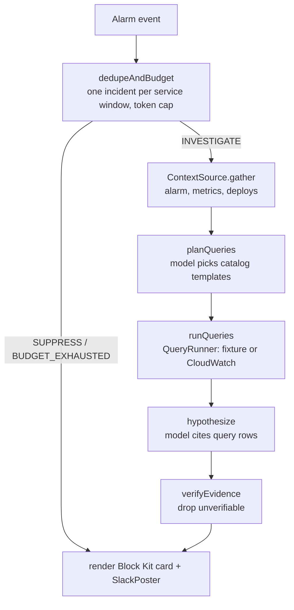

# rca-bot developer guide

## 1. What it is

rca-bot turns a CloudWatch alarm into a Slack card with a root-cause hypothesis.

A model chooses read-only Logs Insights queries from a fixed catalog. It then drafts hypotheses that must cite rows from the query results. A deterministic verifier drops any hypothesis whose quoted values are not verbatim in those rows.

The headline number: top-1 root cause is 100.0% (1 of 1 runs, partial run of 15 planned) with qwen3.8:27b on labelled chaos scenarios. 0 unverified claims were posted, and the verifier blocked 30 of 30 injected fabricated citations. All simulated; none of it ran on AWS.

## 2. Quickstart (5 minutes)

You need Node 22 or newer. Docker is optional.

```bash
git clone <this repo> && cd rca-bot
npm ci
npm test                                     # offline, about 30 seconds
docker compose up -d --wait slack-sink       # optional: local Slack stand-in on :5350
npx tsx src/cli/main.ts demo ddb-throttle-40
docker compose down
```

Open `http://localhost:5350` while the sink is up to see the card. Without the sink, the card goes to `.rca/slack/`.

## 3. Architecture



- `src/core` is pure logic: the Logs Insights subset engine, the catalog, the verifier, confidence and redaction.
- `src/steps` holds the investigation steps. They take ports (store, runner, model) as arguments.
- `src/pipeline/investigate.ts` runs the steps in process. `rca demo` and `rca eval` use it.
- `src/handlers` wraps the same steps as Lambda entrypoints. `infra/` is the CDK app that wires them to EventBridge and Step Functions.
- `src/sim` runs the real demo-service code under a seeded RNG and raises alarms with the rule "3 breaching 1-minute periods".

## 4. Project layout

| Path | What is there |
|---|---|
| `src/core/` | Types, RNG, time, Logs Insights lexer/parser/evaluator, catalog, verifier, confidence, redaction, alarm events |
| `src/steps/` | `dedupeBudget`, `planQueries`, `runQueries`, `hypothesize` |
| `src/ports/` | Incident store (memory, DynamoDB), query runner (fixture, CloudWatch), results store (memory, S3), context source, Slack posters |
| `src/model/` | Model port, Ollama, Bedrock, scripted, heuristic, fabricator, prompts, schemas, factory |
| `src/pipeline/` | `investigate.ts`: the stages and the composed run |
| `src/sim/`, `src/demo/`, `src/chaos/` | Simulator, demo service logic, fault flag and chaos controller |
| `src/slack/` | Block Kit card and terminal rendering |
| `src/eval/` | Scoring, eval harness, fabrication bench |
| `src/cli/` | The `rca` command |
| `src/handlers/` | Lambda entrypoints |
| `infra/` | CDK stacks and app |
| `docker/slack-sink/` | Dependency-free Slack stand-in |
| `scenarios/` | The 5 labelled chaos scenarios |
| `bench/` | Benchmark method and measured results |
| `test/` | Unit, property and CDK assertion tests, mirroring `src/` and `infra/` |
| `docs/adr/` | Architecture decision records |

## 5. Run, test and benchmark

| Task | Command |
|---|---|
| Typecheck | `npm run typecheck` |
| All tests (offline) | `npm test` |
| Build | `npm run build` |
| Check the query catalog | `npm run lint:catalog` |
| Demo | `npx tsx src/cli/main.ts demo <scenarioId> [--model heuristic]` |
| List scenarios | `npx tsx src/cli/main.ts chaos list` |
| Show the last incident | `npx tsx src/cli/main.ts incident show --latest` |
| Bundle Lambdas | `npm run bundle` |
| Synthesize CDK | `npm run synth` |
| Accuracy benchmark | `npm run eval:baseline`, or `... eval run --model ollama:qwen3.8:27b` |
| Fabrication benchmark | `npm run bench:fabrication` |
| LocalStack contract test | `RCA_LOCALSTACK=1 npm run test:integration` (needs `docker-compose.localstack.yml`, a token and a `LOCALSTACK_TAG`) |

Ports used: `5350` for the Slack sink, `5351` for the optional LocalStack. The Docker containers are named `rca-bot-*`.

## 6. Key decisions and what they gave up

| Decision | Gave up | ADR |
|---|---|---|
| One ESM TypeScript package with the CDK app in the repo | Separate deployable packages | [0001](adr/0001-single-esm-package-with-in-repo-cdk.md) |
| A typed query catalog plus a Logs Insights subset engine for fixture mode | Free-form queries; exact parity with the real service until the LocalStack test runs | [0002](adr/0002-query-catalog-and-logs-insights-subset-engine.md) |
| Strict verifier: one bad citation drops the whole hypothesis | Some true hypotheses with one sloppy quote are lost | [0003](adr/0003-strict-citation-verification-and-computed-confidence.md) |
| In-process simulator running the real demo-service code | Realism of a deployed system | [0004](adr/0004-in-process-simulator-for-demo-service-and-chaos.md) |
| Pluggable model: Ollama, Bedrock, heuristic | A single model's tuned prompts | [0005](adr/0005-pluggable-model-ollama-bedrock-heuristic.md) |
| Budgets in tokens, grouping by conditional write | USD cost reporting | [0006](adr/0006-budgets-in-tokens-and-dedupe-by-conditional-write.md) |
| Offline tests, synth-only infra, LocalStack behind a flag | Proof the stacks deploy and run | [0007](adr/0007-offline-tests-synth-only-infra-localstack-gated.md) |
| A local Slack sink as the demo surface | A real Slack workspace in the demo | [0008](adr/0008-slack-sink-as-the-demo-surface.md) |

## 7. Known limits and what is left

- Everything was measured on simulated incidents (`local-fixture`). Nothing was deployed to AWS and the LocalStack contract test was not run.
- Five scenarios written by the same author as the simulator, and no hold-out set.
- Slack buttons are rendered but not wired. Signature verification (I11) and the feedback handler are v0.2.
- The CloudWatch context source reads the alarm and metrics only. A deploy timeline from AWS is v0.2.
- The cold-start fault exists only in the simulator.
- Local model runs are slow here (CPU only), so the LLM benchmark has a small `n`.
- v0.2 ideas: more scenarios and hold-outs, USD pricing once a price sheet is verified, a LocalStack or AWS deploy, Slack interactivity.
